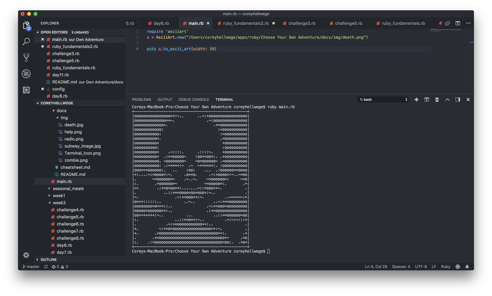
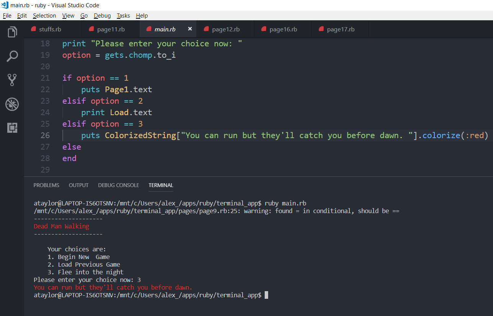
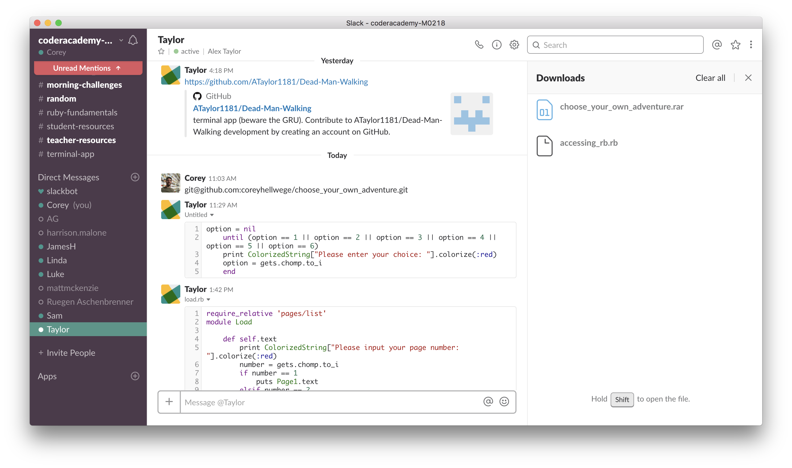
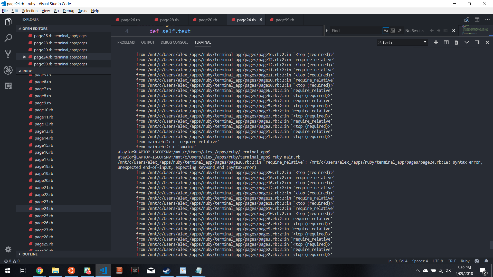

# Choose Your Own Adventure
## :skull: Dead Man Walking :scream_cat: 
</br>

**Repository:**
https://github.com/coreyhellwege/dead_man_walking

### **WHY IT EXISTS:**
___
This app provides a fun alternative to reading a traditional fictional story. If the user is bored with the standard format of a novel, this app allows them to directly interact with the story and choose their own adventure.
### **HOW TO RUN:**
___
Run app using Ruby in your terminal
```bash
$ ruby main.rb
```
### **HOW IT WORKS:**
___
This app is a first-person, 'choose your own adventure' narrative.
1. The app depicts a series of detailed scenarios. 
2. Each secnario prompts you to choose an option from a list of actions. 
3. Your choice dictates how your character proceeds through the story.
4. You can save a bookmark, quit the app and continue from where you left off at a later time.
### **FUNCTIONALITY:**
___
``` ruby
require_relative 'list' # providing access to the 'list' file which contains the colorize and ascii art gems, as well as all other page files

module Page2 # creating first story page file
    def self.text #defining a method which provides access to the file's text

a = AsciiArt.new("img/death.png") # calling the ascii gem, linking an image to be converted and assigning it to a variable 'a'
puts a.to_ascii_art(width: 50) # putting the variable containing the ascii art to the screen and setting a width of 50 pixels

    puts """
You sit in the darkness waiting. Surely someone must know about this train wreck and will be coming to the rescue any minute. \n
The minutes pass…\n
The hour passes…\n
And then hours pass…\n
    """

puts ColorizedString["What would you like to do now? "].colorize(:red) # implementing the colorize gem to make the user prompt stand out
        puts """
        1. Bind your head with cloth from your shirt
        2. Call out to whoever is there
        3. Try to sneak toward the person in the wreckage
        4. Ignore the person in the wreckage and climb through the mess to the front of the train
        """

    print "enter choice now: "    
        choice = gets.chomp.to_i # prompting the user to input an option
            if choice == 1
                puts Page3.text # linking each option to the corresponding story page file, which then displays the next block of text and continues the story
            elsif choice == 2
                puts Page4.text
            elsif choice == 3
                puts Page5.text
            elsif choice == 4
                puts Page6.text
            else
        end
    end
end
```
### **GEMS:**
___
• **ASCII ART** </br>
This gem converts an image into ASCII format and displays it at the command line.



This gem adds methods to set text color, background color and other text effects.



### **PROJECT PLANNING:**
___
**Trello Boards:** </br>
https://trello.com/b/Nkb1d830




### **PROBLEMS WE ENCOUNTERED:**
___
* Missed some 'require relative' declarations
* Incorrect syntax - naming errors for files and methods
* Missing 'end' statements in methods
* Broke strings by accidentally adding/removing quotation marks



### **ADDITIONAL FUNCTIONALITY ADDED:**
___
#### Invalid Option
In the case of the user entering a number which is not a valid menu option we added the following code:
```ruby
option = nil
    until (option == 0 || option == 1 || option == 2 || option == 3 || option == 4 || option == 5 || option == 6) 
    # until loop will print the gets command until the user inputs a relevant option.
    print ColorizedString["Please enter your choice: "].colorize(:red) 
    option = gets.chomp.to_i
    end
```
#### Save and Exit
To allow the user to add a bookmark and exit the app, we added the following code to the story page files:
```ruby
puts ColorizedString["What would you like to do now? "].colorize(:red)

        # adding an option to save and exit
        puts """
        0. Save and exit game
        1. Bind your head with cloth from your shirt
        2. Call out to whoever is there
        3. Try to sneak toward the person in the wreckage
        4. Ignore the person in the wreckage and climb through the mess to the front of the train
        """

        option = nil
        until (option == 0 || option == 1 || option == 2 || option == 3 || option == 4)
        print ColorizedString["Please enter your choice: "].colorize(:red) 
        option = gets.chomp.to_i
        end
    
        if option == 0 
        # if the user selects the option to 'save and exit game' they are given their current page number
            puts "your current page number is 2"
            # and the app then terminates because option 0 has no further link
        elsif option == 1
            puts Page3.text
        elsif option == 2
            puts Page4.text
        elsif option == 3
            puts Page5.text
        elsif option == 4
            puts Page6.text
        else
        end
    end
end
```

And we added the following code to the 'load.rb' file, which is the page where the user can enter their bookmarked page and continue the story

```ruby
require_relative 'pages/list' 
# providing the path for the 'list' file because it is located in a different folder to the current file 'load'

module Load
    def self.text
        print ColorizedString["Please input your page number: "].colorize(:red)
        number = gets.chomp.to_i # prompting the user to input the page number
        if number == 1
            puts Page1.text
        elsif number == 2 # using an if statement to link the user back to the page where they left off
            puts Page2.text
        elsif number == 3
            puts Page3.text
        elsif number == 4
            puts Page4.text
        # and so on...
        else puts ColorizedString["THAT'S NOT A VALID CHOICE" ].colorize(:red)
        end
    end
end
```