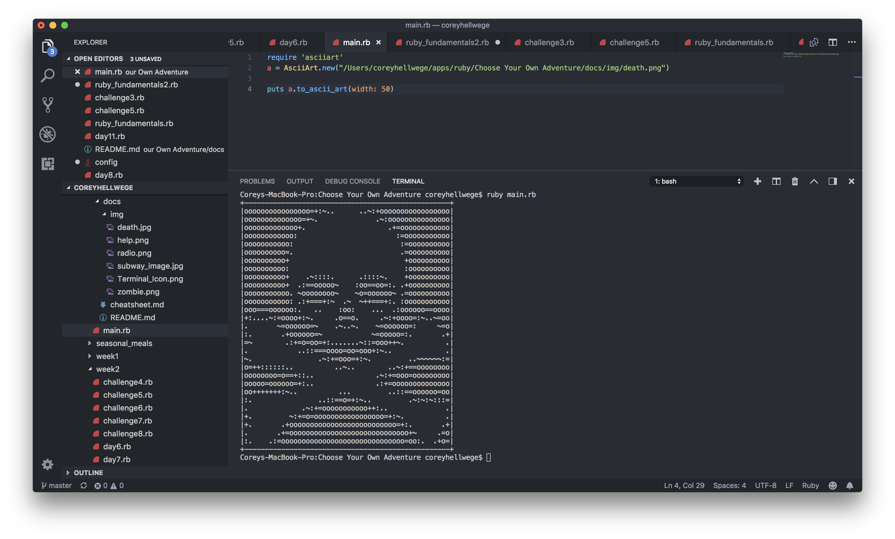
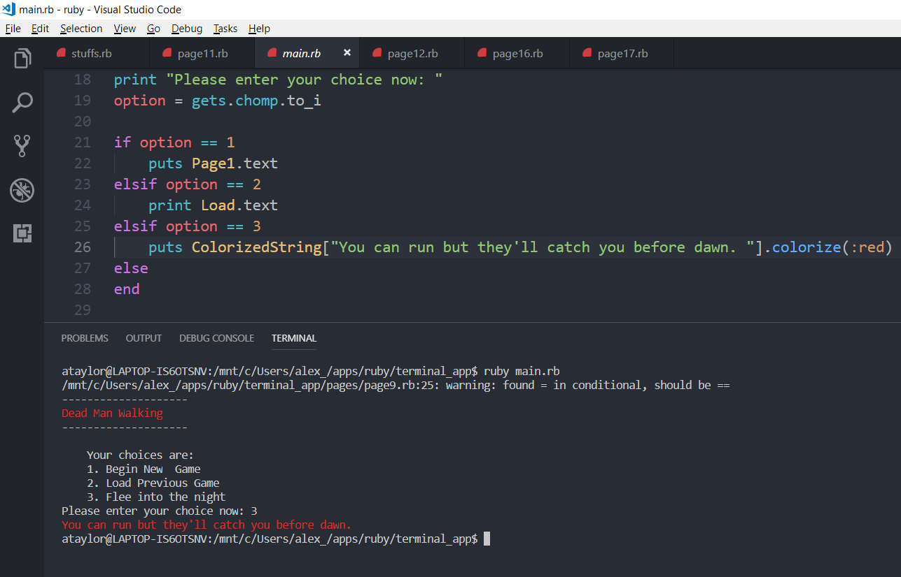

# Choose Your Own Adventure
## :skull: Zombie Apocalypse :scream_cat: 
</br>

### **WHY IT EXISTS:**
___

This app provides a fun alternative to reading a traditional fictional story. If the user is bored with the standard format of a novel, this app allows them to directly interact with the story and choose their own ending.

### **HOW TO RUN:**
___
Run app using Ruby in your terminal
```bash
$ ruby main.rb
```

### **HOW IT WORKS:**
___
This app is a first-person, 'choose your own adventure' narrative.

1. The app depicts a series of detailed scenarios. 
2. Each secnario prompts you to choose an option from a list of actions. 
3. Your choice dictates how your character proceeds through the story.

### **FUNCTIONALITY:**
___

``` ruby
require 'colorized_string' #prividing access colorize gem
require 'asciiart' # providing access to ASCII art gem
require_relative 'page3' #providing access other story page files
require_relative 'page4'
require_relative 'page5'
require_relative 'page6'

module Page2 #creating first story page file
    def self.text #defining a method which provides access to the file's text
    puts """
You sit in the darkness waiting. Surely someone must know about this train wreck and will be coming to the rescue any minute. \n
The minutes pass…\n
The hour passes…\n
And then hours pass…\n
You have been sitting in the darkness for a long time and are starting to feel weak and dizzy in addition to being in pain. Maybe you should have tried to find help for yourself, rather than sit here, probably bleeding out this whole time. On a side note, whoever is there in the train wreckage still seems to be alive – moaning incoherently from time to time.
    "
puts ColorizedString["What would you like to do now? "].colorize(:red) #implementing the colorize gem
        puts """
        1. Bind your head with cloth from your shirt
        2. Call out to whoever is there
        3. Try to sneak toward the person in the wreckage
        4. Ignore the person in the wreckage and climb through the mess to the front of the train
        "
    print "enter choice now: "    
        choice = gets.chomp.to_i #prompting the user to input an option
            if choice == 1
                puts Page3.text #linking each option to the corresponding story page file, which then displays the text and continues the story
            elsif choice == 2
                puts Page4.text
            elsif choice == 3
                puts Page5.text
            elsif choice == 4
                puts Page6.text
            else
        end
    end
end
```
### **GEMS:**
___
• **ASCII ART** </br>
This gem converts an image into ASCII and displays it at the command line.



• **COLORIZE** </br>
This gem adds methods to set text color, background color and text effects.



### **TRELLO:**
___

